# Peak Xender Visual Flow Map

This file contains Mermaid-based flow diagrams for the main systems and workflows in the project.

---

## 1. High-Level System Flow

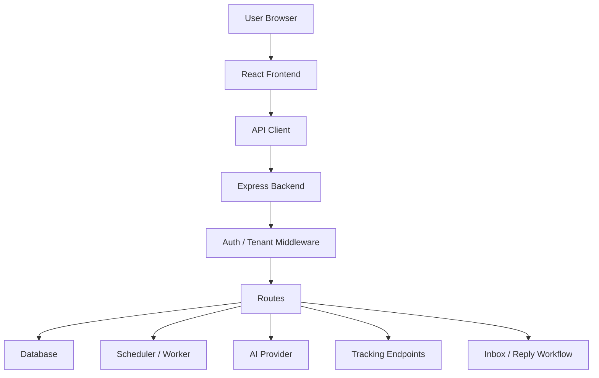

---

## 2. Frontend to Backend Request Flow

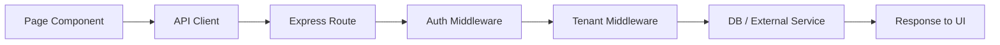

---

## 3. Authentication Flow

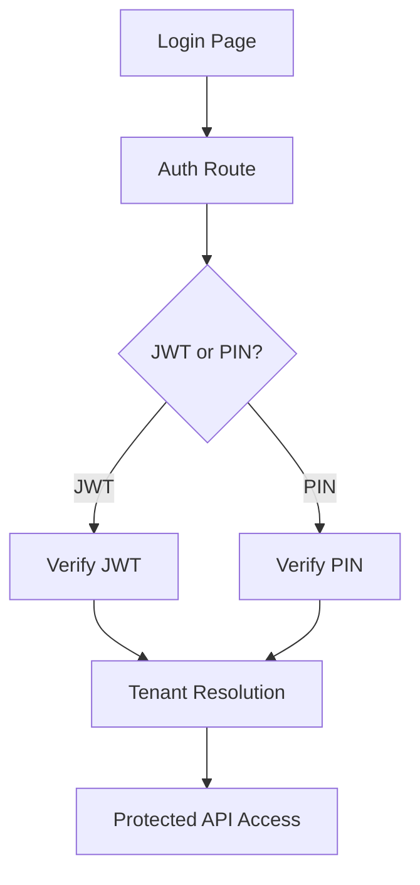

---

## 4. Campaign Lifecycle Flow

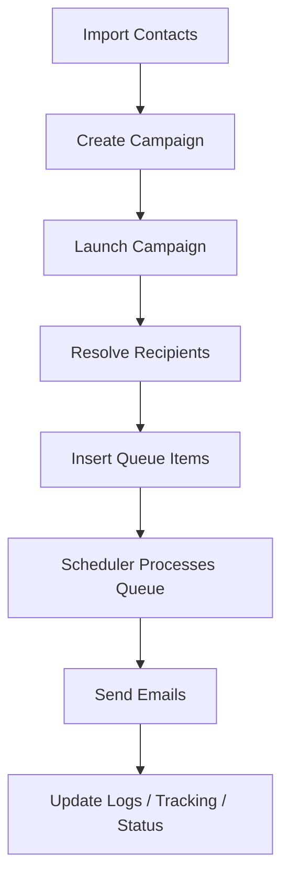

---

## 5. Sending Worker Flow

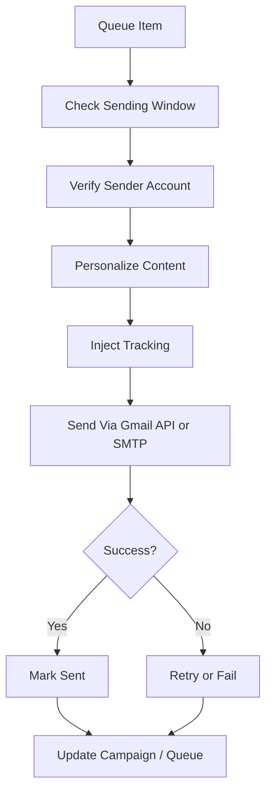

---

## 6. Account Connection Flow

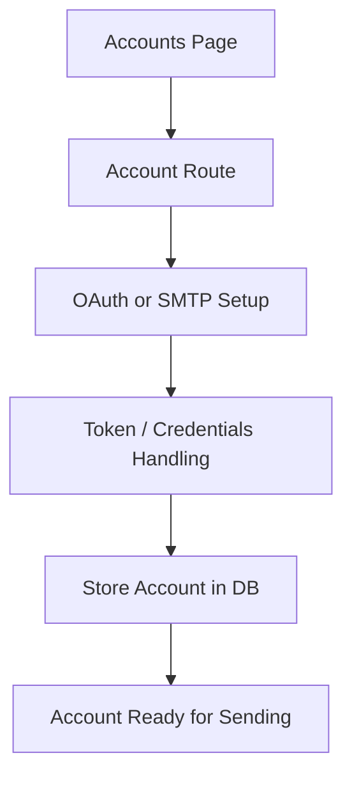

---

## 7. AI Workflow Flow

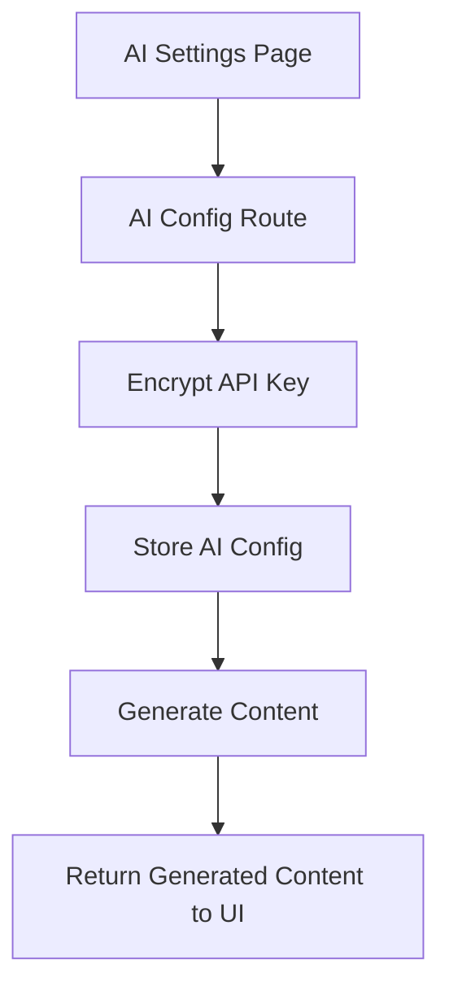

---

## 8. Tracking Flow

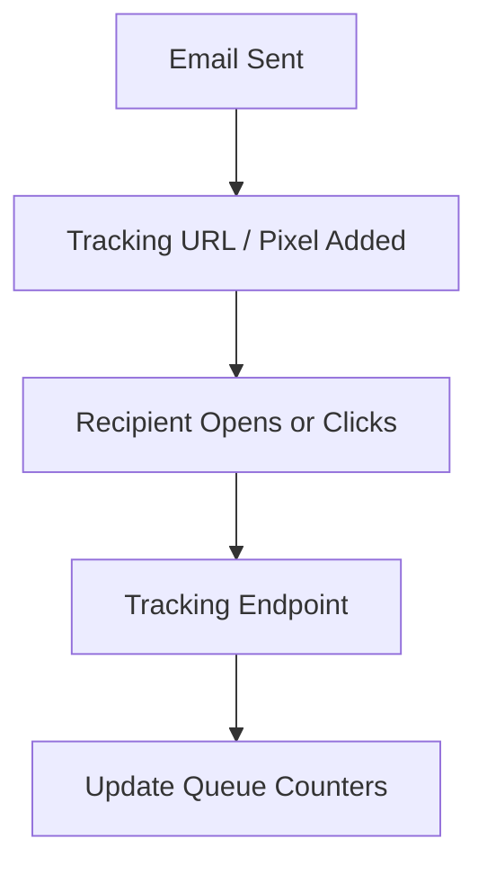

---

## 9. Inbox / Reply Flow

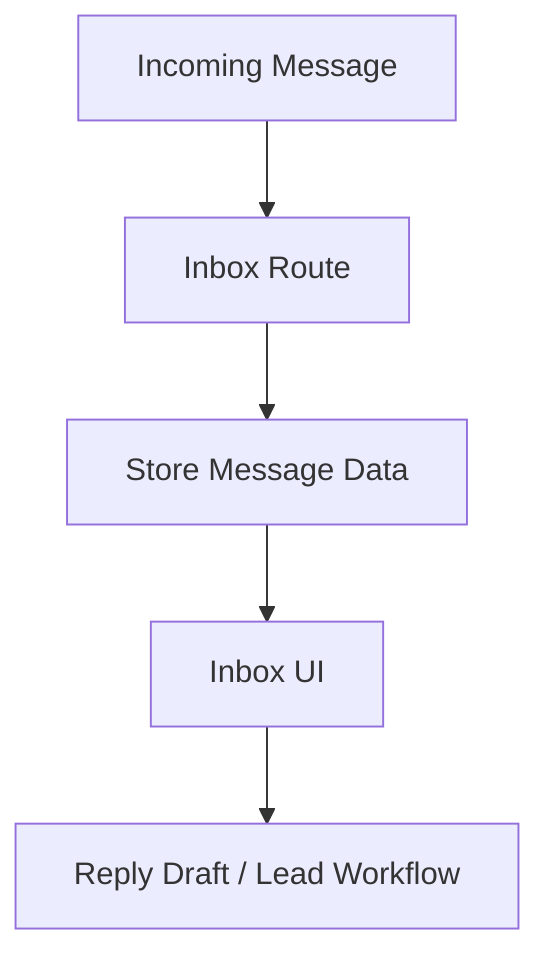

---

## 10. PWA / Native Wrapper Flow

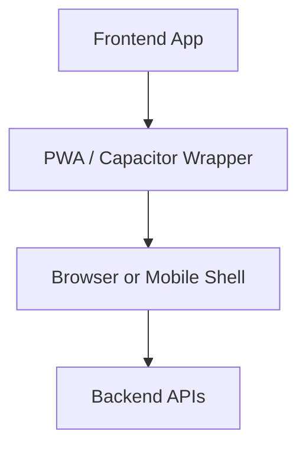

---

## 11. Core Data Model Relationship Flow

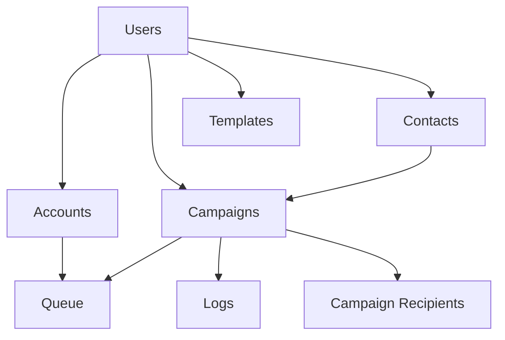

---

## 12. Suggested Visual Narrative

If you want to narrate this system live, use this order:

1. Start with the high-level system flow
2. Show the auth flow
3. Show the campaign lifecycle
4. Show the sending worker flow
5. Show tracking and inbox integration
6. End with the data model relationships
